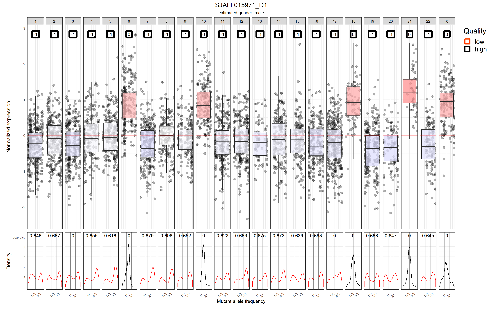
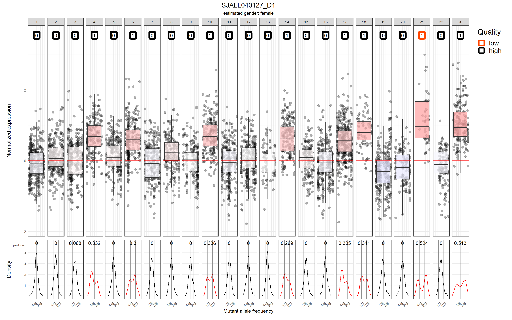
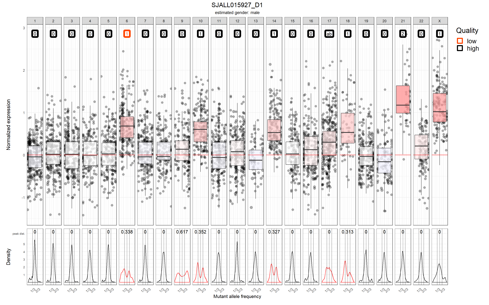
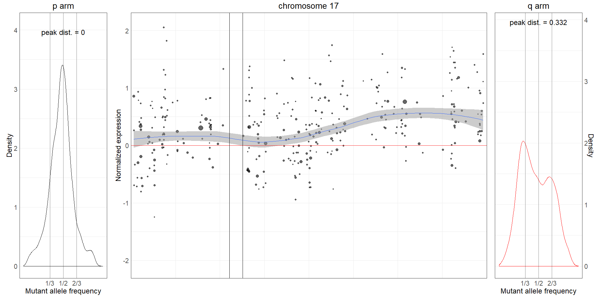
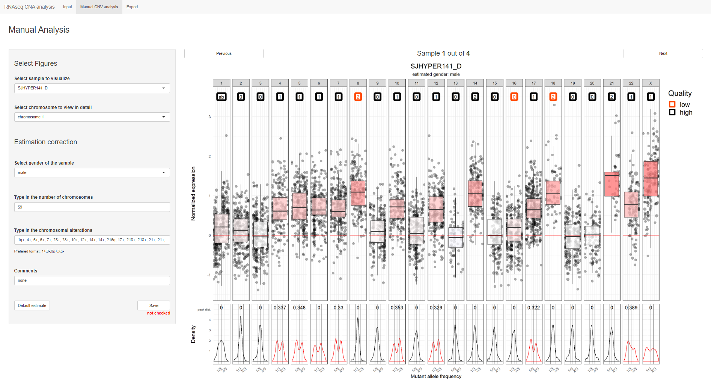
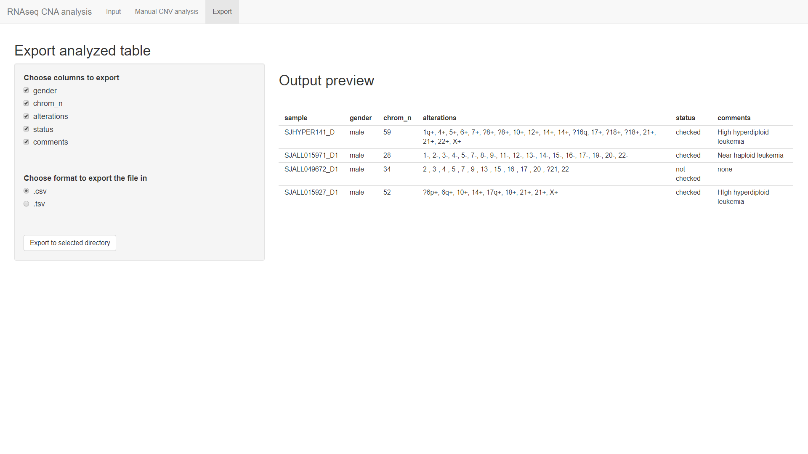

# RNAseqCNV

### An R package for analysis of copy number variations (CNV) from RNA-seq data
This R package is for analysis, visualization and automatic estimation of large-scale (chromosomoal and arm-level) CNVs from RNA-seq data. Users can use either a wrapper function or a Shiny app to generate CNV figures and automatically estimate CNVs on each chromosome. The Shiny app provides an interactive interface to view and double-check the predicted CNV calls.

### Table of contents

1.[Installation](#installation)<br><TD style="FONT-SIZE:13px; COLOR:#000000; LINE-HEIGHT:20px; FONT-FAMILY:Arial,Helvetica,sans-serif">

2.[Functionality](#functionality)<br><TD style="FONT-SIZE:13px; COLOR:#000000; LINE-HEIGHT:20px; FONT-FAMILY:Arial,Helvetica,sans-serif">

&nbsp;&nbsp;&nbsp;&nbsp;&nbsp;&nbsp;1.[Input](#input)<br><TD style="FONT-SIZE:13px; COLOR:#000000; LINE-HEIGHT:20px; FONT-FAMILY:Arial,Helvetica,sans-serif">

&nbsp;&nbsp;&nbsp;&nbsp;&nbsp;&nbsp;&nbsp;&nbsp;&nbsp;&nbsp;&nbsp;&nbsp;1.[Config](#config)<br><TD style="FONT-SIZE:13px; COLOR:#000000; LINE-HEIGHT:20px; FONT-FAMILY:Arial,Helvetica,sans-serif">

&nbsp;&nbsp;&nbsp;&nbsp;&nbsp;&nbsp;&nbsp;&nbsp;&nbsp;&nbsp;&nbsp;&nbsp;2.[Metadata](#metadata)<br><TD style="FONT-SIZE:13px; COLOR:#000000; LINE-HEIGHT:20px; FONT-FAMILY:Arial,Helvetica,sans-serif">

&nbsp;&nbsp;&nbsp;&nbsp;&nbsp;&nbsp;&nbsp;&nbsp;&nbsp;&nbsp;&nbsp;&nbsp;3.[Count files](#count_files)<br><TD style="FONT-SIZE:13px; COLOR:#000000; LINE-HEIGHT:20px; FONT-FAMILY:Arial,Helvetica,sans-serif">

&nbsp;&nbsp;&nbsp;&nbsp;&nbsp;&nbsp;&nbsp;&nbsp;&nbsp;&nbsp;&nbsp;&nbsp;4.[SNV information](#snv_files)<br><TD style="FONT-SIZE:13px; COLOR:#000000; LINE-HEIGHT:20px; FONT-FAMILY:Arial,Helvetica,sans-serif">

&nbsp;&nbsp;&nbsp;&nbsp;&nbsp;&nbsp;&nbsp;&nbsp;&nbsp;&nbsp;&nbsp;&nbsp;&nbsp;&nbsp;&nbsp;&nbsp;&nbsp;&nbsp;1.[VCF](#vcf)<br><TD style="FONT-SIZE:13px; COLOR:#000000; LINE-HEIGHT:20px; FONT-FAMILY:Arial,Helvetica,sans-serif">

&nbsp;&nbsp;&nbsp;&nbsp;&nbsp;&nbsp;&nbsp;&nbsp;&nbsp;&nbsp;&nbsp;&nbsp;&nbsp;&nbsp;&nbsp;&nbsp;&nbsp;&nbsp;2.[Custom tabular data](#custom_table)<br><TD style="FONT-SIZE:13px; COLOR:#000000; LINE-HEIGHT:20px; FONT-FAMILY:Arial,Helvetica,sans-serif">

&nbsp;&nbsp;&nbsp;&nbsp;&nbsp;&nbsp;&nbsp;&nbsp;&nbsp;&nbsp;&nbsp;&nbsp;5.[Basic function parameters](#basic_params)<br><TD style="FONT-SIZE:13px; COLOR:#000000; LINE-HEIGHT:20px; FONT-FAMILY:Arial,Helvetica,sans-serif">

&nbsp;&nbsp;&nbsp;&nbsp;&nbsp;&nbsp;&nbsp;&nbsp;&nbsp;&nbsp;&nbsp;&nbsp;&nbsp;&nbsp;&nbsp;&nbsp;&nbsp;&nbsp;1.[Genome version](#genome_version)<br><TD style="FONT-SIZE:13px; COLOR:#000000; LINE-HEIGHT:20px; FONT-FAMILY:Arial,Helvetica,sans-serif">

&nbsp;&nbsp;&nbsp;&nbsp;&nbsp;&nbsp;&nbsp;&nbsp;&nbsp;&nbsp;&nbsp;&nbsp;&nbsp;&nbsp;&nbsp;&nbsp;&nbsp;&nbsp;2.[Arm-level figures](#arm_level_figures_param)<br><TD style="FONT-SIZE:13px; COLOR:#000000; LINE-HEIGHT:20px; FONT-FAMILY:Arial,Helvetica,sans-serif">

&nbsp;&nbsp;&nbsp;&nbsp;&nbsp;&nbsp;&nbsp;&nbsp;&nbsp;&nbsp;&nbsp;&nbsp;&nbsp;&nbsp;&nbsp;&nbsp;&nbsp;&nbsp;3.[Estimation labels](#estimation_labels)<br><TD style="FONT-SIZE:13px; COLOR:#000000; LINE-HEIGHT:20px; FONT-FAMILY:Arial,Helvetica,sans-serif">

&nbsp;&nbsp;&nbsp;&nbsp;&nbsp;&nbsp;&nbsp;&nbsp;&nbsp;&nbsp;&nbsp;&nbsp;&nbsp;&nbsp;&nbsp;&nbsp;&nbsp;&nbsp;4.[Diploid adjustment](#diploid_adjustment)<br><TD style="FONT-SIZE:13px; COLOR:#000000; LINE-HEIGHT:20px; FONT-FAMILY:Arial,Helvetica,sans-serif">

&nbsp;&nbsp;&nbsp;&nbsp;&nbsp;&nbsp;&nbsp;&nbsp;&nbsp;&nbsp;&nbsp;&nbsp;&nbsp;&nbsp;&nbsp;&nbsp;&nbsp;&nbsp;5.[Analysis mode](#analysis_mode)<br><TD style="FONT-SIZE:13px; COLOR:#000000; LINE-HEIGHT:20px; FONT-FAMILY:Arial,Helvetica,sans-serif">

&nbsp;&nbsp;&nbsp;&nbsp;&nbsp;&nbsp;&nbsp;&nbsp;&nbsp;&nbsp;&nbsp;&nbsp;&nbsp;&nbsp;&nbsp;&nbsp;&nbsp;&nbsp;6.[Gene weights generation](#weights_generation)<br><TD style="FONT-SIZE:13px; COLOR:#000000; LINE-HEIGHT:20px; FONT-FAMILY:Arial,Helvetica,sans-serif">

&nbsp;&nbsp;&nbsp;&nbsp;&nbsp;&nbsp;&nbsp;&nbsp;&nbsp;&nbsp;&nbsp;&nbsp;&nbsp;&nbsp;&nbsp;&nbsp;&nbsp;&nbsp;7.[CNV matrix](#CNV_matrix)<br><TD style="FONT-SIZE:13px; COLOR:#000000; LINE-HEIGHT:20px; FONT-FAMILY:Arial,Helvetica,sans-serif">

&nbsp;&nbsp;&nbsp;&nbsp;&nbsp;&nbsp;2.[Output](#output)<br><TD style="FONT-SIZE:13px; COLOR:#000000; LINE-HEIGHT:20px; FONT-FAMILY:Arial,Helvetica,sans-serif">

&nbsp;&nbsp;&nbsp;&nbsp;&nbsp;&nbsp;&nbsp;&nbsp;&nbsp;&nbsp;&nbsp;&nbsp;1.[Main figure](#main_figure)<br><TD style="FONT-SIZE:13px; COLOR:#000000; LINE-HEIGHT:20px; FONT-FAMILY:Arial,Helvetica,sans-serif">

&nbsp;&nbsp;&nbsp;&nbsp;&nbsp;&nbsp;&nbsp;&nbsp;&nbsp;&nbsp;&nbsp;&nbsp;2.[Arm level figure](#arm_level_figure)<br><TD style="FONT-SIZE:13px; COLOR:#000000; LINE-HEIGHT:20px; FONT-FAMILY:Arial,Helvetica,sans-serif">

&nbsp;&nbsp;&nbsp;&nbsp;&nbsp;&nbsp;&nbsp;&nbsp;&nbsp;&nbsp;&nbsp;&nbsp;3.[Estimation table](#estimation_table)<br><TD style="FONT-SIZE:13px; COLOR:#000000; LINE-HEIGHT:20px; FONT-FAMILY:Arial,Helvetica,sans-serif">

3.[Output interpretation example](#output_interpretation_example)<br><TD style="FONT-SIZE:13px; COLOR:#000000; LINE-HEIGHT:20px; FONT-FAMILY:Arial,Helvetica,sans-serif">

4.[Shiny app](#shiny_app)<br><TD style="FONT-SIZE:13px; COLOR:#000000; LINE-HEIGHT:20px; FONT-FAMILY:Arial,Helvetica,sans-serif">

&nbsp;&nbsp;&nbsp;&nbsp;&nbsp;&nbsp;1.[Input tab](#input_tab)<br><TD style="FONT-SIZE:13px; COLOR:#000000; LINE-HEIGHT:20px; FONT-FAMILY:Arial,Helvetica,sans-serif">

&nbsp;&nbsp;&nbsp;&nbsp;&nbsp;&nbsp;&nbsp;&nbsp;&nbsp;&nbsp;&nbsp;&nbsp;1.[Mock analysis](#mock_analysis)<br><TD style="FONT-SIZE:13px; COLOR:#000000; LINE-HEIGHT:20px; FONT-FAMILY:Arial,Helvetica,sans-serif">

&nbsp;&nbsp;&nbsp;&nbsp;&nbsp;&nbsp;2.[Manual analysis tab](#manual_analysis_tab)<br><TD style="FONT-SIZE:13px; COLOR:#000000; LINE-HEIGHT:20px; FONT-FAMILY:Arial,Helvetica,sans-serif">

&nbsp;&nbsp;&nbsp;&nbsp;&nbsp;&nbsp;3.[Export tab](#export_tab)<br><TD style="FONT-SIZE:13px; COLOR:#000000; LINE-HEIGHT:20px; FONT-FAMILY:Arial,Helvetica,sans-serif">


###  1. Installation <a name="installation"></a>
Users must have [R](https://www.r-project.org/) and [Rtools](https://cran.r-project.org/bin/windows/Rtools/) installed. [Rstudio](https://rstudio.com/products/rstudio/) is optional but recommended IDE.

To install RNAseqCNV package from GitHub, it is convenient to use the package devtools, namely function: install_github. The package installation can take a few minutes.
```
# install devtools
install.packages("devtools")

# install RNAseqCNV package
devtools::install_github(repo = "honzee/RNAseqCNV")
```

Docker image based on rocker/rstudio with RNAseqCNV was also created to facilitate easy deployment: https://hub.docker.com/repository/docker/honzik1/rnaseqcnv. To use the image, docker needs to be installed. For more information on docker, please head to: https://www.docker.com/. The rstudio instance can be deployed by:

```
docker run -it -p 8787:8787 -v /local/path/to/needed/directory/:/where/the/directory/will/be/mounted/ -e PASSWORD=1234 honzik1/rnaseqcnv:0.0.1
```

Users can then find the running Rstudio session in browser under: http://localhost:8787/. The login would be *rstudio* and password *1234*.

### 2. Functionality <a name="functionality"></a>
The results are generated either by a wrapper function: RNAseqCNV_wrapper() or through a Shiny app which is deployed by the launchApp() function. The RNAseqCNV_wrapper() provides more flexibility in terms of function parameters. The Shiny app on the other hand enables easier browsing and checking of the results.

```
# Examples of basic function calls:
library(RNAseqCNV)

# example of wrapper function (DO NOT RUN) 
RNAseqCNV_wrapper(config = "path/to/config", metadata = "path/to/metadata", snv_format = "vcf")

# launch the Shiny app with:
launchApp()
```

#### 2.1. Input <a name="input"></a>
Both the wrapper and the Shiny app receive the same required input. Per-gene read counts and SNV mutant allele frequency (MAF) are used to produce the results. Therefore, two types of information are needed for each sample. Examples of the input files can be found in the package directory. Use the following command to locate the package directory:

```
file.path(find.package("RNAseqCNV"), "inst", "extdata")
```


To run the wrapper or the Shiny app, path to the **config file** and **metadata file** in correct format is needed.

##### 2.1.1 Config file<a name="config"></a>
Config file defines output directory (out_dir), read count file directory (count_dir) and SNV file directory (snv_dir). Change the file directories accordingly but keep the key words identical as the example below:

```
out_dir = "/Path/to/output_dir"
count_dir = "/Path/to/dir/with/count_files"
snv_dir = "/Path/to/dir/with/vcf_files"

```


##### 2.1.2 Metadata file<a name="metadata"></a>
Metadata file contains three columns (separated by comma/tab/space): 1. sample ID; 2. count file; 3. vcf/custom table file. **Header line is not accepted and the column order must be the same as the example below:**

|[]()|||
|--- | --- | ---|
|SJALL014946_D1 | SJALL014946_D1.HTSeq | SJALL014946_D1.vcf|
|SJALL014949_D1 | SJALL014949_D1.HTSeq | SJALL014949_D1.vcf|
|SJALL014950_D1 | SJALL014950_D1.HTSeq | SJALL014950_D1.vcf|

##### 2.1.3 Read count file <a name="count_files"></a>

Output of HTSeq-count or similar read counting software. The table must have two columns: 1. Ensembl gene ids; and 2. read count. The table should not have a header.

| []() |    |
|-----------------|-----|
| ENSG00000000005 | 0   |
| ENSG00000000419 | 94  |
| ENSG00000000457 | 128 |
| ENSG00000000460 | 133 |
| ENSG00000000938 | 171 |
| ENSG00000000971 | 5   |

##### 2.1.4 SNV information <a name="snv_files"></a>

Either VCF file or custom tabular data are accepted.

###### 2.1.4.1 VCF <a name="vcf"></a>

VCF files can be acquired by running [GATK pipeline](https://gatk.broadinstitute.org/hc/en-us/articles/360035531192-RNAseq-short-variant-discovery-SNPs-Indels-).

| #CHROM | POS   | ID | REF | ALT | QUAL   | FILTER | INFO                                                                                                                                                                              | FORMAT         | sample_name           |
|-------|-------|----|-----|-----|--------|--------|-----------------------------------------------------------------------------------------------------------------------------------------------------------------------------------|----------------|--------------------------|
| 1     | 14792 | .  | G   | A   | 156.77 | .      | AC=1;AF=0.500;AN=2;BaseQRankSum=-1.442;ClippingRankSum=0.000;DP=27;ExcessHet=3.0103;FS=1.690;MLEAC=1;MLEAF=0.500;MQ=60.00;MQRankSum=0.000;QD=5.81;ReadPosRankSum=-0.169;SOR=1.124 | GT:AD:DP:GQ:PL | 0/1:19,8:27:99:185,0,644 |
| 1     | 14907 | .  | A   | G   | 126.77 | .      | AC=1;AF=0.500;AN=2;BaseQRankSum=-0.015;ClippingRankSum=0.000;DP=10;ExcessHet=3.0103;FS=2.808;MLEAC=1;MLEAF=0.500;MQ=60.00;MQRankSum=0.000;QD=14.09;ReadPosRankSum=0.751;SOR=1.170 | GT:AD:DP:GQ:PL | 0/1:3,6:9:64:155,0,64    |
| 1     | 14930 | .  | A   | G   | 161.77 | .      | AC=1;AF=0.500;AN=2;BaseQRankSum=0.751;ClippingRankSum=0.000;DP=10;ExcessHet=3.0103;FS=2.808;MLEAC=1;MLEAF=0.500;MQ=60.00;MQRankSum=0.000;QD=17.97;ReadPosRankSum=2.515;SOR=1.170  | GT:AD:DP:GQ:PL | 0/1:3,6:9:64:190,0,64    |

###### 2.1.4.2 Custom tabular data <a name="custom_table"></a>
The table has four required columns: <br/>
- chr: chromosome of the SNV
- start: locus of the SNV
- depth: read depth of this locus
- maf: mutant allele frequency, can be calculated as depth of the mutant allele (compared to reference genome) divided by the overall read depth of the locus.<br/>
The header names should follow the format below:


| chr | start | depth | maf    |
|-----|-------|-------|--------|
| 1   | 14599 | 40    | 0.5   |
| 1   | 14604 | 9    | 0.3333   |
| 1   | 14610 | 10   | 0.25 |

##### 2.1.5 Basic function parameters <a name="basic_params"></a>

Explanation of basic wrapper function parameters and Shiny app options.

###### 2.1.5.1 Genome version <a name="genome_version"></a>
RNAseqCNV provides reference data for genome versions hg19 and hg38 (default). The genome version specific internal data include - gene information, dbSNP SNP list, centromere location and pseudoautosomal regions.
```
RNAseqCNV_wrapper(config = "path/to/config", metadata = "path/to/metadata", snv_format = "vcf", genom_version = "hg38")
```

###### 2.1.5.2 Arm-level figures <a name="arm_level_figures_param"></a>
The plotting of arm-level figures increases the per-sample runtime significantly. You can disable the this by:
```
RNAseqCNV_wrapper(config = "path/to/config", metadata = "path/to/metadata", snv_format = "vcf", arm_lvl = FALSE)
```
or uncheck the appropriate box in the Shiny app interface.

###### 2.1.5.3 Estimation labels <a name="estimation_labels"></a>
The CNV estimation labels can be removed from the figures with:
```
RNAseqCNV_wrapper(config = "path/to/config", metadata = "path/to/metadata", snv_format = "vcf", estimate_lab = FALSE)
```
or by unchecking the appropriate box in the Shiny app interface.

###### 2.1.5.4 Diploid adjustment <a name="diploid_adjustment"></a>
Some samples may have high proportion of chromosomes with CNVs, such as the one below:



With regard to the relative nature of RNA-seq data, in such samples the normalized expression of stably expressed genes on diploid chromosomes will not be centered around zero. To address this issue, the package includes a random forest model, which classifies chromosomes as either diploid or non-diploid. Based on that information the figure is centered in a way that the chromosomes, which are estimated as diploid, are centered around zero:


This functionality is by default turned on. To disable it:
```
RNAseqCNV_wrapper(config = "path/to/config", metadata = "path/to/metadata", snv_format = "vcf", adjust = FALSE)
```
or uncheck the appropriate box in the Shiny app interface.

###### 2.1.5.5 Analysis mode <a name="analysis_mode"></a>
Samples can be analyzed in two modes: batch analysis or per sample analysis. Per sample analysis with in-build standard samples for gene expression normalization and centering is the default.

In batch analysis, the input samples will be used for normalization and gene expression centering (log2 fold change calculation). In this mode, at least 20 samples without high numbers of large-scale CNVs should be provided. For optimal results the samples should be of the same cancer type and library preparation. To use this mode of analysis, use batch = TRUE in the RNAseqCNV_wrapper function.
```
RNAseqCNV_wrapper(config = "path/to/config", metadata = "path/to/metadata", snv_format = "vcf", batch = TRUE)
```

In per sample analysis, each sample will be analyzed against the in-build (or user provided) standard samples. The in-build standard contains gene expression data from 40 ALL samples without large-scale CNVs. Using the in-build standard samples is the default method.

Standard samples can also be provided as an input. Standard samples have to be included in the metadata table and their sample names have to be provided in character vector format (standard_samples parameter) in the RNAseqCNV_wrapper function.
```
RNAseqCNV_wrapper(config = "path/to/config", metadata = "path/to/metadata", snv_format = "vcf", batch = FALSE, standard_samples = c("standard_sample_1,", "standard_sample_2,", "standard_sample_3,"))
```
###### 2.1.5.6 Gene weights generation <a name="weights_generation"></a>
Many factors apart from CNVs can affect gene expression level. Therefore, RNAseqCNV assigns a weight value based on a well-curated CNV dataset to every gene to leverage the importance of each gene in predicting the CNVs. The default, in-build gene weights are based on 426 B-ALL samples, and stem from expression level-CNV correlation and variance of the gene.

To generate weights from the input data, the parameter generate weights should be set to TRUE. However, these weights take into an account only the variance of the gene expression across samples.

```
RNAseqCNV_wrapper(config = "path/to/config", metadata = "path/to/metadata", snv_format = "vcf", generate_weights = TRUE)
```

Users can also provide custom weight matrix according to the format below:

| ENSG            | chromosome_name | weight     |
|-----------------|-----------------|------------|
| ENSG00000000419 | 20              | 121.923504 |
| ENSG00000001167 | 6               | 8.474673   |
| ENSG00000001497 | X               | 442.760032 |

R function get_weights() in:
```
file.path(find.package("RNAseqCNV"), "R", "user_defined_analysis", "get_weights")
```
can help in acquiring weights in the same way the default RNAseqCNV weights for ALL were generated. However, since correlation between gene expression level and CNV is used for weight generation, the function requires known CNV data as an input.

###### 2.1.5.7 CNV matrix <a name="CNV_matrix"></a>
Optionally, the estimated CNVs can be also output in a matrix format, where samples are ordered in rows and chromosome arms in columns.

```
RNAseqCNV_wrapper(config = "path/to/config", metadata = "path/to/metadata", snv_format = "vcf", CNV_matrix = TRUE)
```

Shortened example:

| sample          | 1p | 1q | 2q | 2p | 3p | 3q | 4p | 4q | 5q | 5p | 6p | 6q |
|-----------------|----|----|----|----|----|----|----|----|----|----|----|----|
| sample_1 | 0  | 0  | 0  | 0  | 0  | 0  | 0  | 0  | 0  | 0  | 0  | 0  |
| sample_2 | 0  | 0  | 0  | 0  | 0  | 0  | 0  | 0  | 0  | 0  | 0  | 0  |
| sample_3 | 0  | 0  | 0  | 0  | 0  | 0  | 1  | 1  | 0  | 0  | 1  | 1  |
| sample_4 | 0  | 0  | 0  | 0  | 0  | 0  | 0  | 0  | 0  | 0  | 1  | 1  |

#### 2.2 Output <a name="output"></a>
The output (figures and tables) of both wrapper and the Shiny app will be saved in the output directory as specified in the config file.

##### 2.2.1 Main figure <a name="main_figure"></a>



The main figure consists of two panels.

The upper panel shows the per-chromosome gene expression level. Y axis shows log2 fold change of gene expression against reference samples; x axis shows 23 chromosomes from 1-22-X (chromosome Y is excluded). x axis also represents the position of genes on each chromosome. For each chromosome, a weighted boxplot (1/4, 1/2 and 3/4 quantile) is drawn based upon the distribution of normalized gene expression. For each chromosome, Random Forrest algorithm is used to estimate the CNVs and the results are marked on each chromosome. The CNV calls with low confidence (quality) are highlighted in red. 

The lower panel shows the density graphs of MAF for each chromosome. Please note that only the MAF of heterozygous SNVs (MAF from 0.05 to 0.9 were) is used in determining CNVs. Peak distance, which measures the distance between the two highest peaks in the MAF density plot on x axis, is also marked at the top.

##### 2.2.2 Arm-level figures <a name="arm_level_figure"></a>


Users have the option to generate arm-level CNV figures with either

```
RNAseqCNV_wrapper(config = "path/to/config", metadata = "path/to/metadata", snv_format = "vcf", arm_lvl = TRUE)
```

or checking the option in the Shiny app.

The middle panel is a zoom-in view of one chromosome in the main figure. In the upper part in addition to the random forest estimated alteration, there is also the percentage of trees in the model that agreed upon this alteration. P and q arm's MAF density graphs are shown on either side. Chromosomes without p arm are adjusted accordingly.

##### 2.2.3 Estimation table <a name="estimation_table"></a>
The estimated gender, arm-level alterations and chromosome number are saved in two tables in the output directory. The estimation_table.tsv stores the output of RNAseqCNV models. The manual_an_table.tsv stores the manually curated results by users through the Shiny app.

- sample: sample name as in the metadata table
- gender: estimated based on the expression of genes on chromosome Y
- chrom_n: final number of whole chromosomes in the samples (only high quality, whole chromosome CNVs are taken into account)
- alterations: alterations as estimated by Random Forest model. Gain: "+"; loss: "-"; double gain (and higher): "++"; double loss: "--". 'p' and 'q' specify the chromosomal arms. '?' signifies low confidence CNV calls, whhich should be manually checked.

| sample         | gender | chrom_n | alterations                                                                                 |
|----------------|--------|---------|---------------------------------------------------------------------------------------------|
| SJHYPER141_D   | male   | 59      | 1q+, 4+, 5+, 6+, 7+, ?8+, ?8+, 10+, 12+, 14+, 14+, ?16q, 17+, ?18+, ?18+, 21+, 21+, 22+, X+ |
| SJALL015971_D1 | female | 28      | 1-, 2-, 3-, 4-, 5-, 7-, 8-, 9-, 11-, 12-, 13-, 14-, 15-, 16-, 17-, 19-, 20-, 22-            |
| SJALL049672_D1 | male   | 34      | 2-, 3-, 4-, 5-, 7-, 9-, 13-, 15-, 16-, 17-, 20-, ?21, 22-                                   |
| SJALL015927_D1 | female | 52      | ?6p+, 6q+, 10+, 14+, 17q+, 18+, 21+, 21+, X+                                                |

### 3. Output interpretation example <a name="output_intrepretation_example"></a>

By combining the gene expression level and MAF density graphs, it is possible to estimate CNVs with high accuracy and sensitivity. The examples below represent some of the common CNVs patterns.

The figure below is an example for result interpretation.



- diploid chromosomes: 1, 2, 3, 4, 5, 7, 8, 11, 12, 13, 15, 16, 19, 20, 22. The median expression level should be centered around zero (especially if diploid level adjustment was performed). The MAF density graphs of heterozygous SNVs have the highest peaks around 0.5. 

- copy neutral loss of heterozygozity (LOH): 9. The expression is around the same level as other diploid chromosomes, which suggests two copies, however, the density graph is consistent with LOH, indicating this is copy neatural LOH.

- single gain: 6, 10, 14, 18. The expression is significantly higher than that of diploid chromosomes. Meanwhile, the MAF density graph shows imbalance of allele distribution (3 copies in total, 1:2 or 2:1), which is typical for single copy gain.

- double gain: 21. The expression is usually even higher than that of single copy gain. However, the MAF graphs can have two patterns according to the copy of alleles (4 copies in total, 3:1 or 2:2). In this case, the MAF density peak is centered around 0.5 indicating two additional copies are from different alleles (maternal and paternal).

- chromosome X: Estimation of CNVs on chromosome X is more challenging since X inactivation in female makes MAF graphs not informative. However, approximate copy number of X chromosome can be estimated based on the expression level. In this case the higher expression suggests a single copy gain at least.

- partial gain/loss: Large CNV segments shorter than whole chromosome. The MAF density is normally distorted, but not in a typical pattern. Partial CNVs are marked as "ab" in the main figure which need further curation on the arm-level:



In this case, it is clear, that there is partial gain on q arm of chromosome 17.


- 1 copy deletion: 1, 2, 3, 4, 5, 7, 8, 9, 11, 12, 13, 14, 15, 16, 17, 19, 20, 22. The chromosomes with deletions have significantly lower gene expression compared to diploid ones, and the imbalanced MAF density suggests only one copy of alleles are left for these chromosomes.

### 4. Shiny app <a name="shiny_app"></a>
The Shiny app enables CNV analysis similar to the RNAseqCNV_wrapper. In addition, it provides an interactive interface to view the result and curate the reported CNVs. It is launched by:
```
launchApp()
```
#### 4.1 Input tab <a name="input_tab"></a>

The Shiny app needs a metadata file and a config file as input. Users have the option to analyze the first sample as a test run or full analyze of all the samples in the metadata table. After the analysis (either through RNAseqCNV_wrapper or Shiny app), the two other tabs (Manual CNV analysis and Export) will be shown.

Users can adjust the parameters [(mentioned earlier)](#basic_params) for the analysis through check boxes and radio buttons.

##### 4.1.1 Mock analysis <a name="mock_analysis"></a>
To test the app and the package, there is an option to perform mock analysis with built-in example data without any input config and metadata. The results will be saved in the directory selected by the user after clicking the button "Mock analysis". The Manual analysis tab and Export tab will be available after the mock analysis is done.

#### 4.2 Manual analysis tab <a name="manual_analysis_tab"></a>


In this tab, users can browse through the analyzed samples and arm-level figures (if generated). Users can correct the CNV calls manually and add comments. After manual curation, users can click "Save" button to save the changes into the manual analysis table in the output directory. Button "Default analysis" can restore the original CNV output into the manual analysis table.

#### 4.3 Export <a name="export_tab"></a>


This tab enables customized table export by selecting desired columns.
